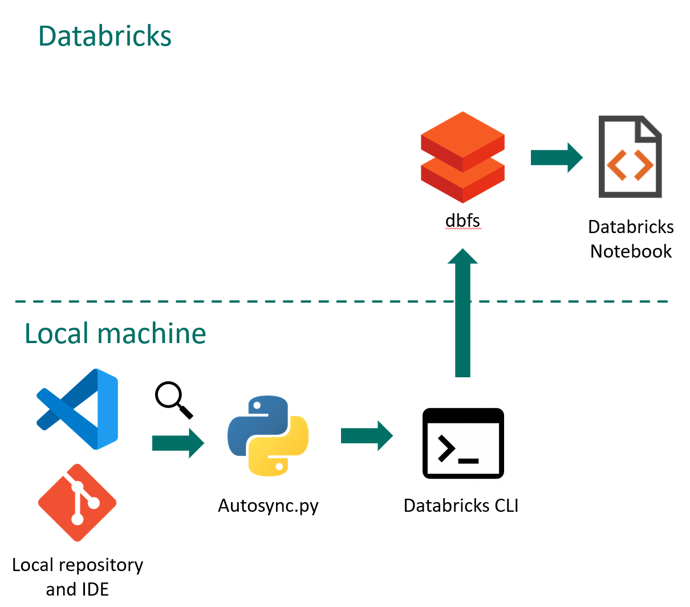

# Autosync

## Description
Autosync is a script that watches a folder for file changes and updates the same files on Databricks Filesystem (dbfs).



- First it will copy all files of the targeted folder to dbfs.
- Whenever a file is created, modified or deleted, it will also create, modify or delete it on dbfs, usually within a couple of seconds.

## How to use.

1. Clone this repository
2. In the config.yaml, specify
    - profile of the Databricks environment you want to sync to. See "Setting up databricks CLI"
    - local_root: the directory that you want to sync to dbfs. 
    - recursive: whether to sync subdirectories and files as well
    - patterns: patterns to filter files. See "Patterns"
3. 
- Open a terminal, navigate to this folder and run autosync.py.
- Double click autosync.bat to run it directly.

4. In your databricks notebook, add the that are mentioned once the script starts running. This will be in the form of
```
# cell 1
%load_ext autoreload
%autoreload 2
```
```
# cell 2
import sys
sys.path.insert(0, '/dbfs/FileStore/packages/<c_number>/<repository_name>/')
```


## Patterns
You can filter files and folders that should be included in the sync. A file has a valid pattern if all four conditions are met:
- matches any of the 'or patterns'
- matches all of the 'and patterns'
- does not match any of the 'nor patterns'
- does not match all of the 'nand patterns'

If you leave a pattern empty, that condition will count as met. A pattern can be any regex pattern. A re.search(..) will be performed on the file path converted to posix (so "C:/users/code/my_package" instead of "C:\user\code\my_package")

Example: sync all .py and .json files that are in a folder that contains the word 'mortgage'
```
patterns:
  or: 
    - ".py"
    - ".json"
  and: 
    - "mortgage"
```

Example: sync all files of any type that contain either the word 'mortgage' or 'payments', but only in the 'spark/dags' folder. Ignore files in /tests/* folders.
```
patterns:
  or: 
    - "mortgage"
    - "payments"
  and: 
    - "spark"
  nor:
    - "/tests/
```

Example: Sync everything in the root directory, except for python files that are in the /tests/ folder
```
patterns:
  or: 
  and: 
  nor:
  nand: 
    - ".py"
    - "/venv/"
```


